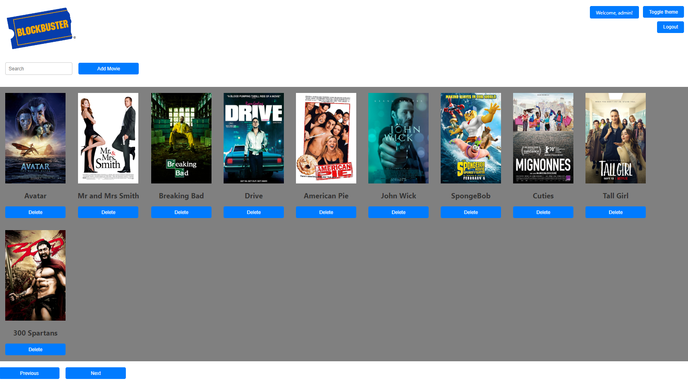

# General overview
Web application Front-End part made in ReactJS for saving movies which you viewd before on a website which pirated it so in case you want to rewatch the movie again you could just click on the movie so that it automatically opens up the previouse website where you viewed that movie. 

# Building process

Use the following commands in order to start the front-end application, but without the backend it will not work
```
npm start
```
After which a new web tab will open with the website open

# Features
- Ability to view the movies from the list
- Ability to add new movies to the list
- Ability to delete a movie from the list
- Ability to login with permissions
- Ability to change theme of the website (light/dark)
- Ability to go to forward and backword on the pages

# How it should look



## Aditional Notes:
The application won't inheritly work without the use of the back-end application which could be found [here](https://github.com/LeonidCaminschi/tum-web-lab7). You must start both front-end and back-end in order for it to work as intended.

